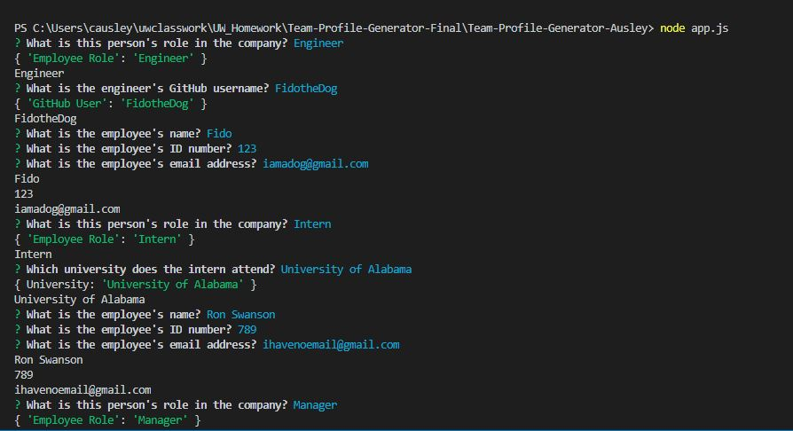

# Team-Profile-Generator

## Description

Team Profile Generator is a command-line-interface application, that allows the user to easily generate a team profile webpage for their office and group mates, featuring their basic ID and contact info. All the user is required to do is answer a series of prompted quesitons on the command line about each member, and an HTML file will automatically generate once finished. 

The user is first prompted to select what kind of team member they would like to add, then they may add as many managers, engineers and interns as they like alongside their individual information. When they have finished adding all the team members that they would like to, they may open up their generated html document in the browser and view their new pre-styled team profile.

Building this program brought all of the skills together I've been studying into one, including object oriented programming, jest, basic and quick CSS styling, and most of all, how to work and navigate within the terminal to build files as I shift from a front-end developer to a full-stack developer. 

## Table of Contents
* [Usage](#usage)
* [Technologies](#technologies)
* [Questions](#questions)
* [Installation](#Installation)
* [Tests](#Tests)
* [Credits](#Credits)
* [Finished Product](#finished-product)


## Usage
* Navigate to Team-Profile-Generator folder and install dependencies.
* Run node app.js to begin.
* Answer prompted questions about team members.
* May add one manager, and as many engineers and interns as the user wants.
* When you are finished adding team members select the "I'm done" option.
* Open your generated HTML file in the browser to view your teams profile.

### Answer these Questions:


### Generate a Team Profile:


## Finished Product
View a video demonstrating the application at https://youtu.be/x3T4oTLhq98.

## Technologies
* HTML
* CSS
* Bootstrap
* JavaScript
* Node.js
* Jest
* npm
* Inquirer.js


## Installation
To install necessary dependencies, run the following command: 
``` 
npm install 
``` 

## Tests
To run tests, run the following command: 
``` 
npm run test 
```

## Credits
* [Inquirer.js](https://www.npmjs.com/package/inquirer)
* [Bootstrap](https://getbootstrap.com/docs/4.1/getting-started/introduction/)

## Questions
​
If you have any questions about the repo, please contact me:

On GitHub: [cmausley](https://github.com/cmausley) | Via Email: christinamausley@gmail.com